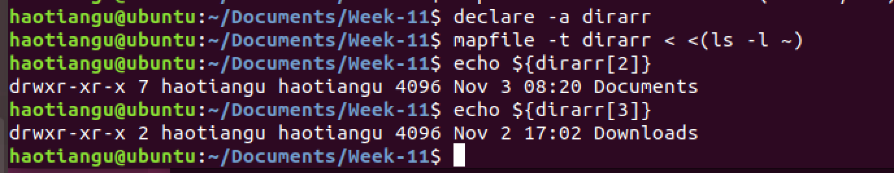
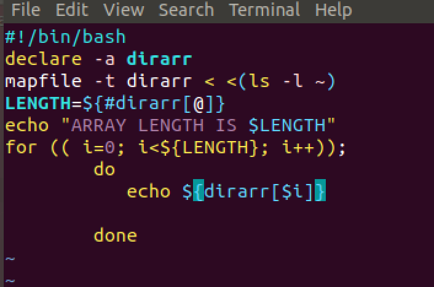
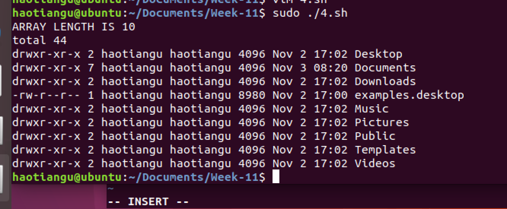

# Week-11
##1
declare -a itemARRAY

##2

##3

##4
0/5 0 * * * ~/Documents/Week-11/4.sh
##5
*if [ -a /datapool ]
*then
*echo "The directory exists"
*else
*echo "Directory doesn't exist"
*fi

##6
mv $1 /datapool1

##7
*if [ $# -gt 1 ]
*then
*echo "keep running"
*else
*exit
*fi

##8
*if [ -a $1 && -x ]
*then
        *echo "$1 is executable"
*else
        *echo "$1 is not executable"
*fi

##9
*if [ -a $1 && -e ]
*then
    *    echo "$1 is exists"
*else
     *   echo "$1 is not exists"
*fi

#10
*if [ -a $1 && -d ]
*then
     *   echo "$1 is dirctory"
*elif [ -a $1 && -f ]
       * echo "$1 is file"
*else 
    	*echo "$1 is not a file or directory"
fi

##11

*echo "This is \$0: $0"
*echo "This is the length of the number of items passed in \$# (not counting \$0): $#"
*echo "This is the entire array of items passed in \$@: $@"

##12
*echo "This is \$0: $0">~/Documents/my.log
*echo "This is the length of the number of items passed in \$# (not counting \$0): $#">~/Documents/my.log
*echo "This is the entire array of items passed in \$@: $@">~/Documents/my.log

